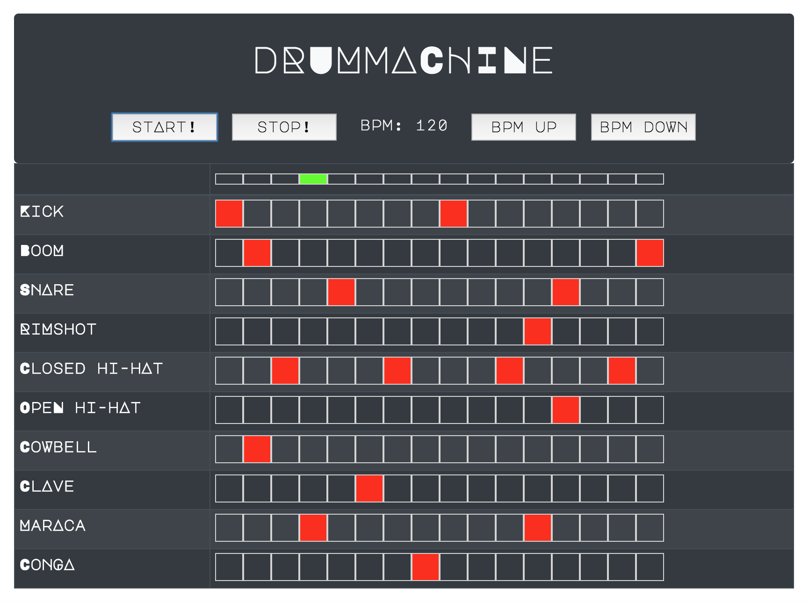

# Drum Machine V1

10 sound drum machine with 16 step sequencer, currently using the HTMLAudioElement interface. Built with React.

## V2 on the way

Updated version in progress, using the Web Audio API with tone.js library. This will address the timing issues inherent to the js setTimeout plus allow for additional functionality such as a synthesizer engine, effects etc.
